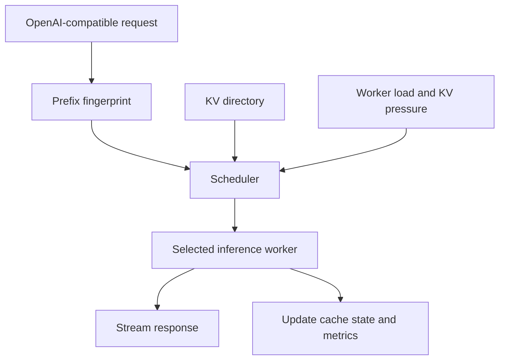

# CachePilot

**A KV-cache-aware routing layer for LLM inference.**

CachePilot routes requests using both worker load and reusable prompt state. It makes every routing decision observable, then benchmarks when locality-aware routing helps, when it creates hotspots, and how that tradeoff changes under saturation.

> **Current result:** In a continuous-batching simulation, KV-aware routing improved throughput by **16–25%** on shared-prefix workloads near saturation. A one-worker Qwen measurement also found that requests classified as cache hits reached first token in **204 ms**, compared with **400 ms** for misses. Multi-worker GPU validation remains the main next step.

## Why CachePilot

LLM requests often repeat large prefixes: system prompts, tool schemas, retrieved documents, and conversation history. Standard round-robin or least-loaded routing can send those requests to workers that do not hold the relevant KV state, forcing the model to repeat prefill computation.

CachePilot asks a narrow systems question:

> Can a router reuse cached prefixes without concentrating enough traffic on one worker to make queueing worse?

It is a research and observability layer around inference servers, not a replacement for vLLM, SGLang, or TensorRT-LLM.

## What it includes

- An OpenAI-compatible gateway with streaming responses.
- Round-robin, least-loaded, and KV-aware scheduling policies.
- Prefix fingerprinting and a per-worker logical KV directory with LRU eviction.
- A deterministic benchmark harness with seven workload patterns.
- Two worker models: a simple latency model and a continuous-batching model that can saturate.
- An adapter for OpenAI-compatible inference servers such as vLLM and `mlx_lm.server`.
- An operator console for worker health, cache state, request traces, and policy comparisons.
- Structured event logs, Prometheus metrics, and persisted explanations for every routing decision.

## How it works



The KV-aware policy scores each healthy worker using:

```text
score = α × prefix_overlap
      - β × normalized_load
      - γ × kv_pressure
      - δ × predicted_ttft
```

The router therefore prefers a warm worker only while the expected prefill savings outweigh queueing and memory pressure. Each decision stores the candidate scores and a human-readable reason.

Prompts are normalized, split into fixed-size chunks, and cumulatively hashed. Two requests share cacheable state only across their common leading chunks. Prompt text is never persisted.

For the full cache model and its relationship to vLLM, SGLang, Dynamo, and llm-d, see [`docs/kv-cache-design.md`](docs/kv-cache-design.md).

## Key results

All multi-worker results below are simulated. Each policy receives the same seeded request stream on three workers.

| Scenario | Result from KV-aware routing |
| --- | --- |
| Shared-prefix-heavy | TTFT p50 fell **16%** and cache hit rate rose from **59.4% to 79.2%** |
| Bursty traffic | TTFT p50 fell **31%** and p99 fell **14%** |
| Cache pressure | Cache hit rate rose from **10.7% to 29.1%** |
| Shared prefixes near saturation | Throughput rose **16–25%**, with lower TTFT |

Three findings matter more than any single number:

1. **Locality matters when prefixes are large, repeated, and distributed across a working set.** Small or independent prompts show little benefit.
2. **Cache reuse can improve throughput, not just latency.** In the batching model, avoiding cold prefill prevents stalls for other active sequences.
3. **Pure cache affinity fails under load.** Removing the load and TTFT penalties concentrated traffic on one worker, produced a 3.0 imbalance, and pushed TTFT into tens of seconds.

The default blended policy avoids that collapse by allowing queueing cost to override affinity. The best load weight still depends on whether the cluster is below or above its saturation knee.

### Real-worker check

A live run used Qwen2.5-0.5B-Instruct in 4-bit mode through `mlx_lm.server` on an Apple M1 Pro. With one worker, this cannot evaluate routing quality, but it can test whether the gateway's estimated residency predicts actual reuse:

- Estimated cache hits: **204 ms TTFT p50**
- Estimated cache misses: **400 ms TTFT p50**
- Fitting the estimator reduced held-out error to **41–44 ms**

These measurements support the residency signal, but not the multi-worker performance claims. Full benchmark settings, replications, sensitivity sweeps, and raw comparisons are in [`docs/benchmarking.md`](docs/benchmarking.md).

## Quick start

Run the backend, frontend, and PostgreSQL with Docker:

```bash
make dev
```

Then open `http://localhost:5173` or inspect the workers directly:

```bash
curl localhost:8000/api/workers
```

To run without Docker, using SQLite:

```bash
uv venv --python 3.12 .venv
source .venv/bin/activate
make install
make backend
make frontend
```

## Run a benchmark

Replay the same bursty workload under all three policies:

```bash
make bench WORKLOAD=bursty REQUESTS=1000 SEED=42
```

Other useful experiments:

```bash
python -m benchmark.loadscan --workload hotspot_tight --rates 10,20,30
python -m benchmark.sweep --all-workloads
```

The benchmark runner calls the same gateway and scheduler code used by the API. It uses an event clock so concurrent requests advance in deterministic simulated time.

## Use a real inference server

Point CachePilot at any OpenAI-compatible endpoint:

```bash
export CACHEPILOT_VLLM_URL=http://localhost:8001
export CACHEPILOT_VLLM_MODEL=Qwen/Qwen2.5-0.5B-Instruct
export CACHEPILOT_SIMULATED_WORKER_COUNT=0
make backend
```

For vLLM deployment, live benchmarking, and estimator fitting, see [`docs/real-workers.md`](docs/real-workers.md).

## Observability

Every response includes request, decision, policy, and worker identifiers. The API and operator console expose request timing, all candidate scores, cache residency, lifecycle events, predicted versus observed TTFT, and Prometheus metrics.

## Tests

```bash
make test
make lint
```

The suite covers scheduler invariants, deterministic simulation, prefix consistency, LRU behavior, worker transitions, API integration, benchmark reproducibility, estimator fitting, and batching behavior under capacity limits.

## Limitations

- Multi-worker results currently come from deterministic simulation, not a GPU cluster.
- The real-worker evidence uses one small model, one machine, and 72 measured requests.
- The gateway tracks estimated residency for real workers because the OpenAI API does not expose exact cache contents.
- The batching simulator captures saturation and prefill stalls, but omits chunked prefill, preemption, block fragmentation, and shared memory pressure between active sequences and cached prefixes.
- Policy weights were swept one at a time. Seed variance was larger than many apparent weight effects, so the simulated optimum should not be treated as a production default.

The next validation target is a controlled multi-worker vLLM deployment with prefix caching enabled, followed by refitting the queue model using batch occupancy rather than queue depth alone.

## Documentation

- [`docs/kv-cache-design.md`](docs/kv-cache-design.md): cache identity, sizing, residency, routing, and saturation.
- [`docs/benchmarking.md`](docs/benchmarking.md): complete results, workload definitions, replications, and sensitivity analysis.
- [`docs/real-workers.md`](docs/real-workers.md): real-server setup, live measurements, and estimator fitting.

## License

MIT
